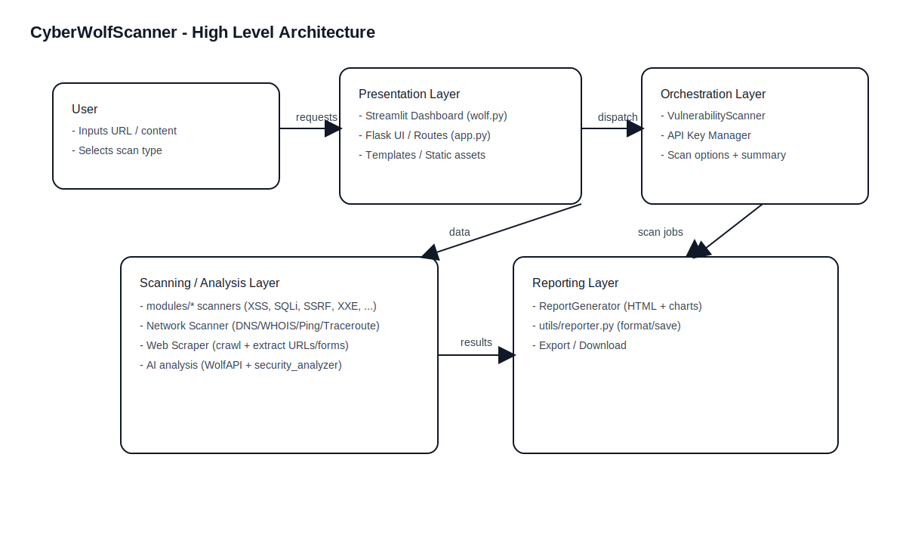

# System Architecture

## 7.1 High-Level Architecture



CyberWolfScanner follows a layered architecture:

- **Presentation Layer**
  - Streamlit UI: `wolf.py`
  - Flask Web UI: `templates/` rendered by `app.py`

- **Application/Orchestration Layer**
  - Scan orchestration via `VulnerabilityScanner` (`modules/scanner.py`)
  - API key management in Flask app (`ApiKeyManager` in `app.py`)

- **Scanning/Analysis Layer**
  - Modular scanners under `modules/` (XSS, SQLi, SSRF, XXE, RCE, CSRF, IDOR, JWT, SSL, Port, Path, Misconfig, API, Bruteforce)
  - Network/DNS scanner: `modules/network_scanner.py`
  - Web scraping/crawling: `web_scraper.py`
  - AI-assisted analysis: `wolf_api.py`, `security_analyzer.py`

- **Reporting Layer**
  - HTML report generation with charts: `report_generator.py`
  - Additional reporting helpers: `utils/reporter.py`, `utils/report_generator.py`

## 7.2 Component Diagram (Mermaid)

```mermaid
graph LR
  U[User] --> SUI[Streamlit UI\n(wolf.py)]
  U --> FUI[Flask UI\n(templates + app.py)]

  SUI -->|calls| API[WolfAPI\n(wolf_api.py)]
  SUI -->|runs| SA[Security Analyzer\n(security_analyzer.py)]
  SUI -->|uses| WS[Web Scraper\n(web_scraper.py)]
  SUI -->|uses| NS[Network Scanner\n(modules/network_scanner.py)]
  SUI -->|generates| RG[ReportGenerator\n(report_generator.py)]

  FUI -->|validates| V[URL Validator\n(utils/validator.py)]
  FUI -->|orchestrates| VS[VulnerabilityScanner\n(modules/scanner.py)]
  VS --> XSS[modules/xss_scanner.py]
  VS --> SQLI[modules/sqli_scanner.py]
  VS --> PORT[modules/port_scanner.py]
  VS --> PATH[modules/path_scanner.py]
  VS --> MIS[modules/misconfig_scanner.py]
  VS --> SSL[modules/ssl_scanner.py]
  VS --> API2[modules/api_scanner.py]
  VS --> OTHER[SSRF/XXE/RCE/IDOR/CSRF/JWT/Bruteforce]

  VS -->|results| FUI
  RG -->|HTML report| U
```

## 7.3 Deployment View

- **Local mode:**
  - Streamlit runs locally and opens a browser UI.
  - Flask runs locally (port `5000` by default in `main.py`).

- **External dependencies:**
  - Optional Gemini/Wolf API key for AI-assisted analysis.

## 7.4 Security Considerations (Architecture)

- API keys should be stored using environment variables (`WOLF_API_KEY` / `GEMINI_API_KEY`), not hardcoded.
- Network scanning uses OS commands (ping/traceroute). This requires controlled environments and permission.
- Input validation is important to prevent SSRF or misuse of scanner endpoints.
