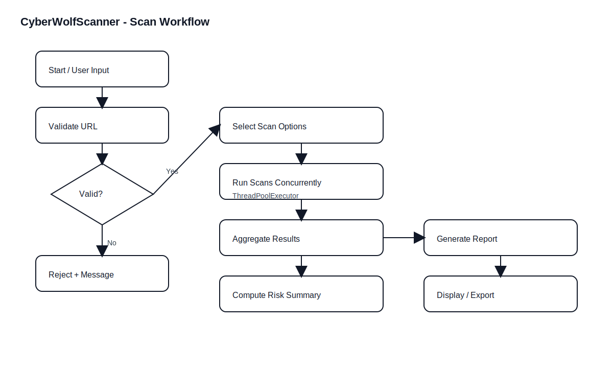
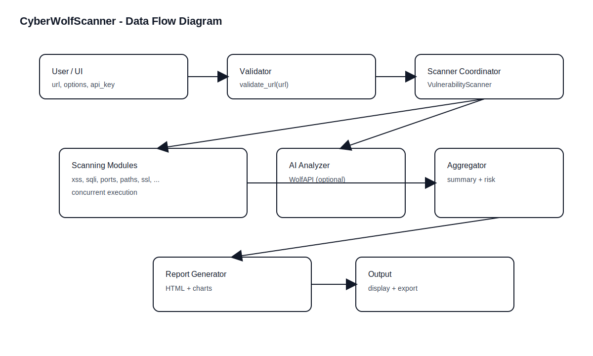
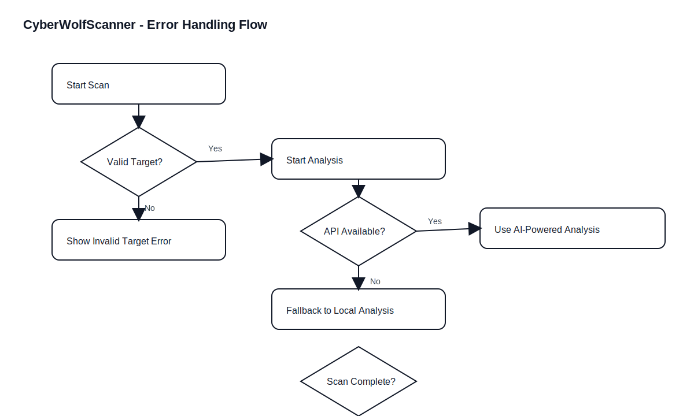
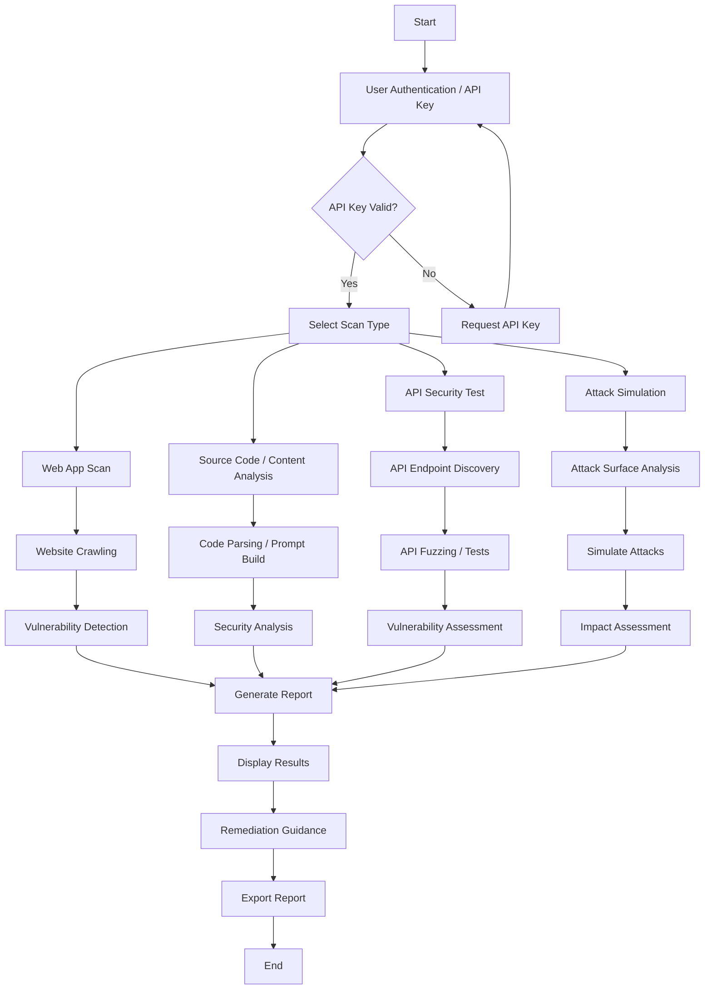

# Data Flow & Workflow Tables

## 10.1 End-to-End Workflow (Based on Repository)

This workflow is derived from:

- `workflow_map.md`
- Flask scanning flow in `app.py`
- Streamlit dashboard flow in `wolf.py`
- Scan coordinator in `modules/scanner.py`

## 10.2 Workflow Table (Functional Flow)

| Step | Actor | Input | Processing | Output |
|---|---|---|---|---|
| 1 | User | Target URL / content | Select scan type (basic / api / AI-assisted) | Scan request |
| 2 | System | URL | Validate URL (`utils/validator.py`) | Valid/invalid decision |
| 3 | System | Options | Initialize scanners (`modules/scanner.py`) | Scanner objects |
| 4 | System | URL | Run scans concurrently (`ThreadPoolExecutor`) | Findings per module |
| 5 | System | Findings | Aggregate results + compute risk summary | Results + summary |
| 6 | System | Results | Generate report (`report_generator.py` / `utils/reporter.py`) | HTML/text report |
| 7 | UI | Report | Display results dashboard | Visual output |
| 8 | User | Export request | Download/export report | Saved report |

## 10.3 Data Flow Table (Key Data Structures)

| Data Item | Type | Producer | Consumer | Purpose |
|---|---:|---|---|---|
| `url` | string | User/UI | Validators + scanners | Target definition |
| `options` | dict | UI | `VulnerabilityScanner` | Enable/disable scan modules |
| `results` | dict | `VulnerabilityScanner` | UI + reporter | Consolidated scan output |
| `summary` | dict | `VulnerabilityScanner` | UI + report | Total counts + risk level |
| `analysis_text` | string | `security_analyzer.py` | `WolfAPI` | Prompt for AI analysis |
| `report_html` | string | `ReportGenerator` | UI/user | Rendered report |

## 10.4 Scan Options Table

Default scans executed when `options` is not provided (`modules/scanner.py`):

| Module Key | Description |
|---|---|
| `xss` | Cross-site scripting checks |
| `sqli` | SQL injection checks |
| `ports` | Port scan / service check |
| `paths` | Directory/path discovery |
| `misconfig` | Common misconfiguration checks |
| `xxe` | XML external entity checks |
| `ssrf` | Server-side request forgery checks |
| `rce` | Remote code execution checks |
| `idor` | Insecure direct object reference checks |
| `csrf` | CSRF pattern checks |
| `jwt` | JWT token security checks |
| `api` | API security checks |
| `bruteforce` | Weak credential/bruteforce heuristics |
| `ssl` | TLS/SSL configuration checks |

## 10.5 Risk Level Table (As Implemented)

The scan coordinator computes risk by **vulnerability count**:

| Total Findings | Risk Level |
|---:|---|
| 0 | MINIMAL |
| 1-2 | LOW |
| 3-5 | MEDIUM |
| 6-10 | HIGH |
| >10 | CRITICAL |

## 10.6 Error Handling Workflow

| Error Type | Where | Handling Strategy |
|---|---|---|
| Invalid URL | Validator / Scanner init | Reject with message and stop scan |
| Timeout | Module scan | Catch exception, record empty results |
| Unexpected exception | Scan orchestration | Log error; continue remaining tasks |
| AI unavailable | `WolfAPI` | Switch to demo-mode simulated output |

## 10.7 Mermaid Workflow (Copied/Aligned)

