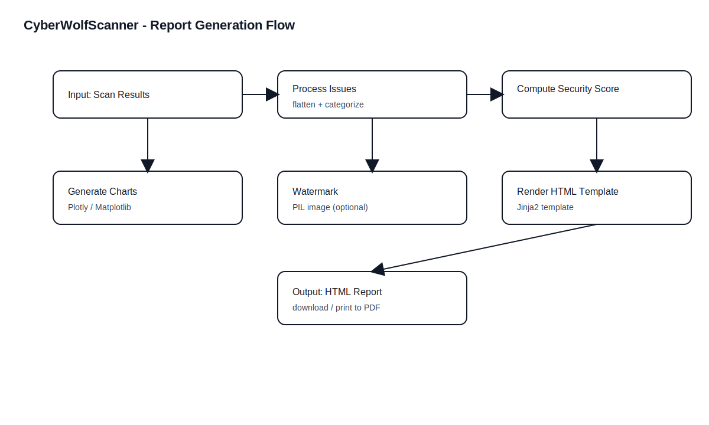

# Report Generation & Output Formats

## 12.1 Report Types in the Repository

CyberWolfScanner supports generating structured output primarily as:

- HTML report (rich layout, charts) via `report_generator.py`
- Additional reporting utilities via `utils/reporter.py` and `utils/report_generator.py`

## 12.2 ReportGenerator (HTML + Visualizations)

### Code Mapping

- File: `report_generator.py`
- Class: `ReportGenerator`

### Inputs

- `results`: scanning results list/dict depending on calling path
- `url`: scan target

### Outputs

- HTML report string (rendered using Jinja templates)

### Visualizations Generated

| Visualization | Library | Purpose |
|---|---|---|
| Security score gauge | Plotly | Show overall posture |
| Issue distribution (pie) | Plotly Express | Severity/priority distribution |
| Issues by category (bar) | Plotly Express | Findings per scan type |
| Security headers heatmap | Matplotlib + Seaborn | Quick view of header presence |

## 12.3 Data Preparation

Key transformations:

- Flatten module results into a list of issues containing:
  - title, description, priority, recommendation, category
- Compute security score based on issue counts and criticality

## 12.4 Template Rendering

- Uses `templates/report_template.html` (Jinja2)
- Injects:
  - `url`, `timestamp`
  - `security_score`
  - `issues`
  - `visualizations` (base64 images)
  - `watermark`

## 12.5 Export Considerations

- HTML is easiest for rich visualizations.
- PDF export can be done by:
  - Browser print-to-PDF
  - External tools like Pandoc (Markdown-based report)
  - Dedicated HTML-to-PDF tools (not included by default)

## 12.6 Recommended Output Strategy for Project Submission

- Include:
  - Markdown report in `Document/`
  - HTML security scan report generated by the tool in `reports/` (runtime output)
  - Screenshots of dashboards and sample results in `Document/assets/`
