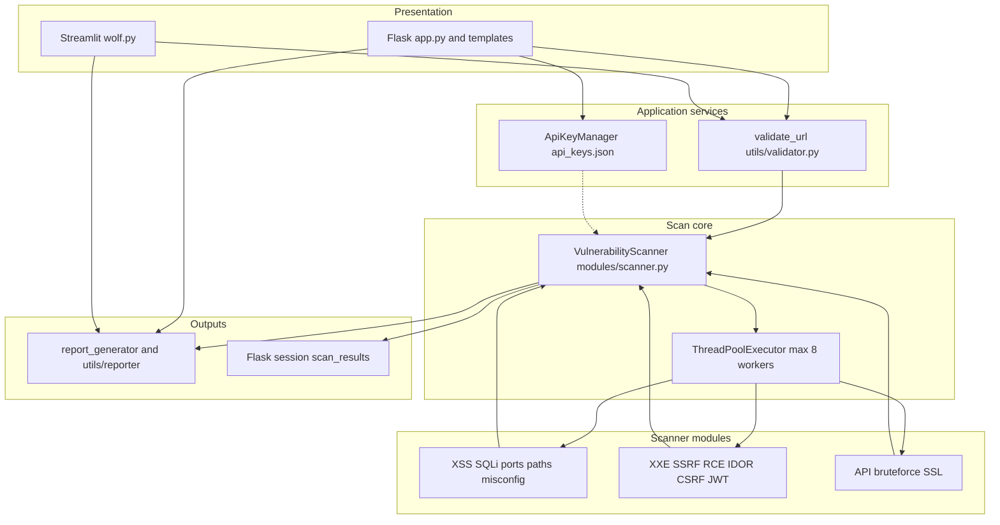
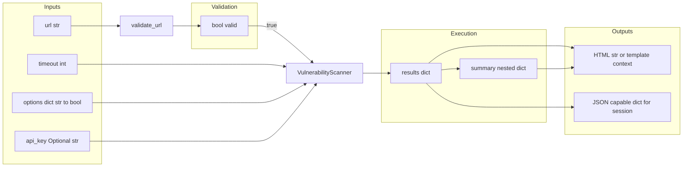
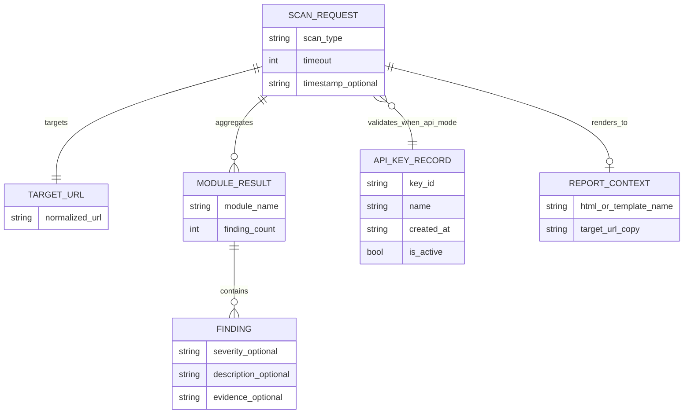
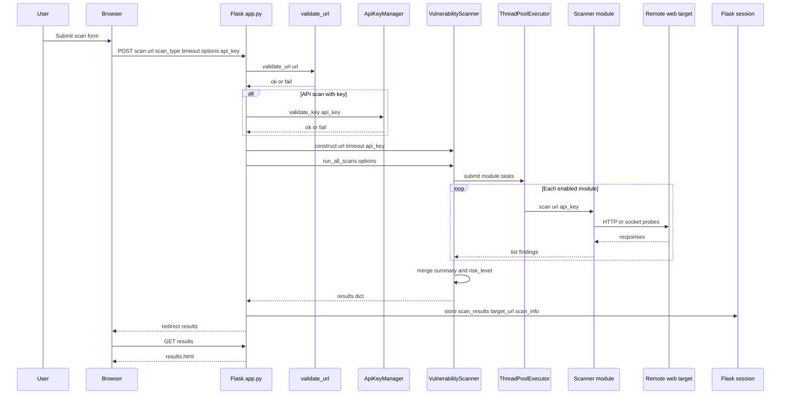

# First Review — CyberWolfScanner

**Document purpose:** Architecture, data flow (with types), ER view, sequence interactions, sample code pointers, pseudocode, descriptions, and logic-to-file references for reviewer read-through.

**Mermaid rules used here:** No backticks inside diagram text; plain labels only (GitHub-safe). Code samples live in fenced Markdown blocks outside diagrams.

---

## 1. System description (reviewer summary)

CyberWolfScanner is a Python web-security analysis tool. **Flask** (`app.py`) serves HTML flows (scan form, results, API key management). **Streamlit** (`wolf.py`) offers an alternate dashboard. The core coordinator is **`VulnerabilityScanner`** in `modules/scanner.py`: it validates the target URL, runs enabled scanner modules in a **thread pool** (max eight workers), merges **list-shaped findings** per module, and computes a **summary** including **risk_level** from total finding counts. Reports use `report_generator.py` and `utils/reporter.py`. API keys for optional API-mode scans are stored in **`api_keys.json`** via **`ApiKeyManager`** in `app.py`.

---

## 2. Architecture diagram

Layers and main components (control and data move top-down and back to the user).



### Architecture description

- **Presentation** collects URL, timeout, scan type, optional API key, and module toggles.
- **Application services** enforce URL shape and optional API key validity before heavy work.
- **Scan core** owns the **results** dictionary shape and **run_all_scans** orchestration.
- **Modules** are independent classes; each **scan** method returns a **list** (possibly empty).
- **Outputs** bind results to HTML templates, downloads, or Streamlit widgets.

---

## 3. Data flow diagram (with types)

Logical flow of values through the system. Types are Python-oriented as implemented.



### Type reference table

| Symbol / name | Type (conceptual) | Producer | Consumer | Notes |
|---------------|-------------------|----------|----------|--------|
| url | str | User / form | validator, scanners | Must pass validate_url |
| timeout | int | Form (clamped 5–60 in Flask) | VulnerabilityScanner, requests | Default from config |
| options | dict[str, bool] | UI checkboxes | run_all_scans | Keys: xss, sqli, ports, paths, … |
| api_key | str or None | Form / header | ApiKeyManager, scanners | Optional enhanced behavior |
| results | dict | VulnerabilityScanner | session, templates, report | Module keys map to list |
| summary | dict | run_all_scans | UI, charts | Counts plus total_vulnerabilities, risk_level |
| finding item | typically dict or str in list | module scan | report | Structure varies by module |

**Shape of results (top-level keys):** xss, sqli, ports, paths, misconfig, xxe, ssrf, rce, idor, csrf, jwt, api, bruteforce, ssl, summary.

**Shape of summary after run:** per-module integer counts, then **total_vulnerabilities** (int) and **risk_level** (str: MINIMAL, LOW, MEDIUM, HIGH, CRITICAL).

---

## 4. ER diagram (logical / persistence view)

The product is not a single RDBMS; this ER model captures **logical entities** and relationships (session, JSON file, in-memory structures).



### ER description

- **SCAN_REQUEST:** One user-initiated scan (Flask POST or Streamlit action).
- **TARGET_URL:** Validated URL string attached to the request.
- **MODULE_RESULT:** One row per module (xss, sqli, …); **finding_count** matches list length.
- **FINDING:** Zero or more records per module; fields depend on scanner implementation.
- **API_KEY_RECORD:** Persisted in **api_keys.json**; linked only when scan_type is API mode and key validates.
- **REPORT_CONTEXT:** Ephemeral binding of **results** + **target_url** for template rendering or export.

---

## 5. Sequence diagram (Flask scan and results)



---

## 6. Sample code references (repository)

### 6.1 Scanner construction and results layout

```47:63:modules/scanner.py
        self.results = {
            'xss': [],
            'sqli': [],
            'ports': [],
            'paths': [],
            'misconfig': [],
            'xxe': [],
            'ssrf': [],
            'rce': [],
            'idor': [],
            'csrf': [],
            'jwt': [],
            'api': [],
            'bruteforce': [],
            'ssl': [],
            'summary': {}
        }
```

### 6.2 Flask scan route (validate, optional API key, run, session)

```140:179:app.py
        # Validate URL
        if not validate_url(url):
            flash('Invalid URL format. Please enter a valid URL.', 'danger')
            return redirect(url_for('scan'))
        
        # Validate API key if API scan is selected
        if scan_type == 'api' and api_key:
            if not api_key_manager.validate_key(api_key):
                flash('Invalid API key. Please provide a valid API key or generate a new one.', 'danger')
                return redirect(url_for('scan'))
        
        # Ensure at least one scan type is selected
        if not any(attack_options.values()):
            flash('Please select at least one attack type to perform.', 'warning')
            return redirect(url_for('scan'))
        
        try:
            # Run the scan
            scanner = VulnerabilityScanner(
                url=url,
                timeout=timeout,
                api_key=api_key,
                verbose=True
            )
            
            # Run selected scans
            scan_results = scanner.run_all_scans(attack_options)
            
            # Store scan information in session for report page
            session['scan_results'] = scan_results
            session['target_url'] = url
            session['scan_info'] = {
                'timestamp': datetime.now().strftime('%Y-%m-%d %H:%M:%S'),
                'scan_type': scan_type,
                'timeout': timeout,
                'attack_options': attack_options
            }
            
            # Redirect to results page
            return redirect(url_for('results'))
```

### 6.3 Module interface example (returns list)

```53:63:modules/xss_scanner.py
    def scan(self, url, api_key=None):
        """
        Scan the given URL for XSS vulnerabilities
        
        Args:
            url (str): Target URL to scan
            api_key (str, optional): API key for enhanced scanning
        
        Returns:
            list: Found XSS vulnerabilities details
        """
```

---

## 7. Pseudocode references

### 7.1 run_all_scans (orchestration)

```
PROCEDURE run_all_scans(options)
    IF options is NULL THEN
        options := all module flags TRUE
    END IF
    tasks := empty map future to module_name
    CREATE thread pool with max_workers = 8
    FOR EACH module_key in enabled(options) DO
        submit wrapper _run_<module>_scan to pool
        store future in tasks
    END FOR
    FOR EACH completed future in tasks DO
        TRY
            result := future.result(timeout = self.timeout)
            self.results[module] := result
            self.summary[module] := length(result)
        CATCH any error
            log error
            self.results[module] := empty list
            self.summary[module] := 0
        END TRY
    END FOR
    total := sum of all summary counts (module keys only, before adding totals)
    self.summary.total_vulnerabilities := total
    self.summary.risk_level := map total to MINIMAL LOW MEDIUM HIGH CRITICAL
    RETURN self.results
END PROCEDURE
```

### 7.2 Risk level mapping (as implemented)

```
FUNCTION risk_from_total(total)
    IF total > 10 THEN RETURN CRITICAL
    IF total > 5  THEN RETURN HIGH
    IF total > 2  THEN RETURN MEDIUM
    IF total > 0  THEN RETURN LOW
    RETURN MINIMAL
END FUNCTION
```

### 7.3 Single module scan (generic)

```
PROCEDURE module_scan(url, api_key, timeout)
    findings := empty list
    send probes to url with timeout
    FOR EACH response or signal DO
        IF pattern matches vulnerability heuristic THEN
            append structured finding to findings
        END IF
    END FOR
    RETURN findings
END PROCEDURE
```

---

## 8. Description references (behaviors to verify in review)

| Topic | Expected behavior | Primary location |
|--------|-------------------|------------------|
| URL rejection | Invalid URL never constructs VulnerabilityScanner | `utils/validator.py`, `modules/scanner.py` __init__ |
| API key | Invalid key blocks scan when API mode selected | `app.py` ApiKeyManager |
| Partial failure | One module exception clears that module only | `modules/scanner.py` future loop |
| Concurrency cap | At most eight parallel module workers | `ThreadPoolExecutor(max_workers=8)` |
| Session scope | Results page reads scan_results from session | `app.py` results route |
| Flask attack options | Form sends xss sqli ports paths only; `run_all_scans` uses options.get(key, True), so absent keys stay enabled | `app.py` attack_options and `modules/scanner.py` |

---

## 9. Logic references (file and responsibility)

| Logic area | File(s) | Responsibility |
|------------|---------|------------------|
| HTTP routes and flash messages | app.py | Scan form, results, download, API key UI |
| API key CRUD | app.py class ApiKeyManager | Persist keys in api_keys.json |
| Scan orchestration | modules/scanner.py | Thread pool, merge, summary, risk |
| XSS checks | modules/xss_scanner.py | Payloads, forms, response analysis |
| SQLi checks | modules/sqli_scanner.py | Injection heuristics |
| Port / path / SSL / API / etc. | modules/*_scanner.py | Domain-specific probes |
| URL validation | utils/validator.py | Allowed schemes and shape |
| Report assembly | report_generator.py, utils/reporter.py | HTML and file output |
| Streamlit UX | wolf.py | Alternate UI and charts |
| Defaults and config | config.py | Timeouts and app constants |

---

## 10. Related documents

| Document | Role |
|----------|------|
| working.md | Extended Mermaid flows and IEEE reference table |
| Document/07_System_Architecture.md | Written architecture |
| Document/10_Dataflow_Workflow_Tables.md | Tables and workflow |
| workflow_map.md | Additional diagram notes |

---

*First review pack — CyberWolfScanner. Filename: 1st-review.md (use this spelling in links and citations).*
