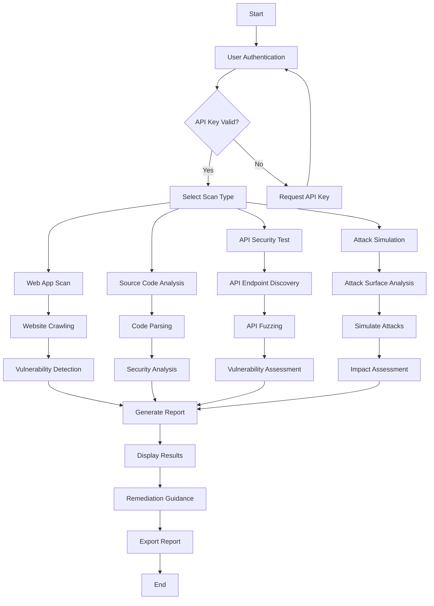
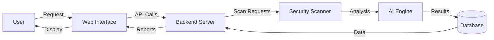
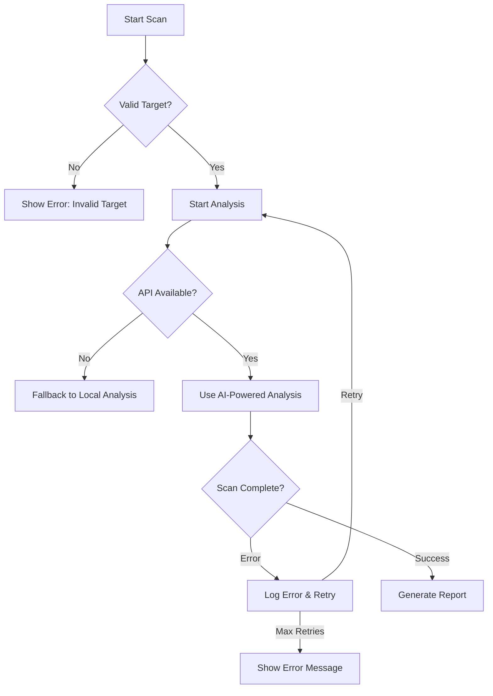

# CyberWolf Security Scanner - Workflow Map

## Workflow Description

### 1. Initialization
- **User Authentication**: Verify user credentials and API key
- **API Key Validation**: Ensure valid API key is provided before proceeding

### 2. Scan Types
- **Web Application Scan**:
  - Crawl the target website
  - Analyze for common vulnerabilities (XSS, SQLi, etc.)
  - Generate security report

- **Source Code Analysis**:
  - Parse uploaded source code
  - Identify security anti-patterns
  - Detect hardcoded secrets and vulnerable functions

- **API Security Testing**:
  - Discover API endpoints
  - Test for common API vulnerabilities
  - Validate authentication/authorization

- **Attack Simulation**:
  - Analyze attack surface
  - Simulate various attack scenarios
  - Assess potential impact

### 3. Analysis & Reporting
- **Vulnerability Correlation**: Cross-reference findings
- **Risk Assessment**: Prioritize issues by severity
- **Remediation Guidance**: Provide actionable fixes
- **Report Generation**: Create detailed security report

### 4. Output
- Interactive dashboard with findings
- Exportable reports (PDF/HTML/CSV)
- Integration with issue trackers

## Data Flow

## Components Interaction

1. **Frontend (Streamlit UI)**
   - User interface for scan configuration
   - Real-time results visualization
   - Report generation and export

2. **Backend (Python)**
   - Request handling
   - Scan job management
   - Data processing

3. **AI Engine (Gemini & Wolf LLM)**
   - Vulnerability detection
   - False positive reduction
   - Contextual analysis

4. **Database**
   - Store scan results
   - User preferences
   - Historical data

## Error Handling

This workflow ensures a robust and efficient scanning process while maintaining flexibility for different types of security assessments.
