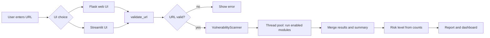
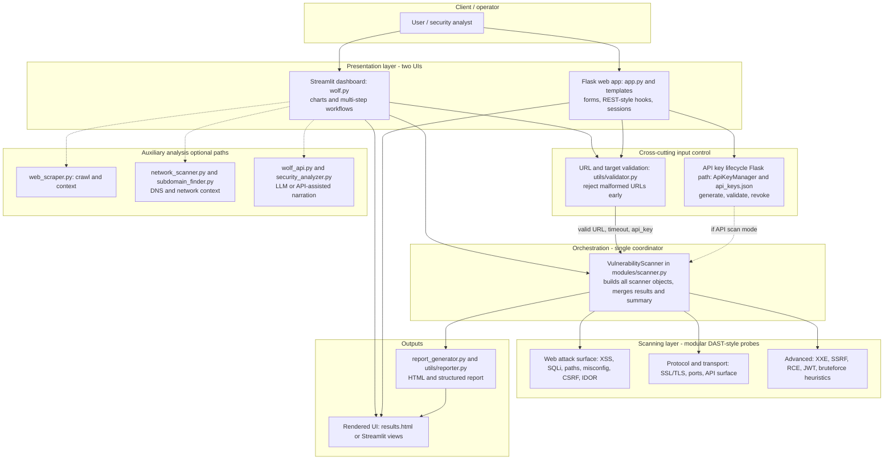
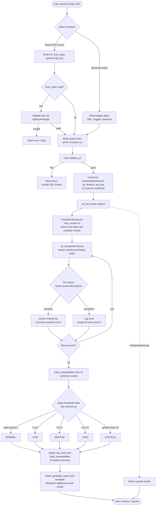
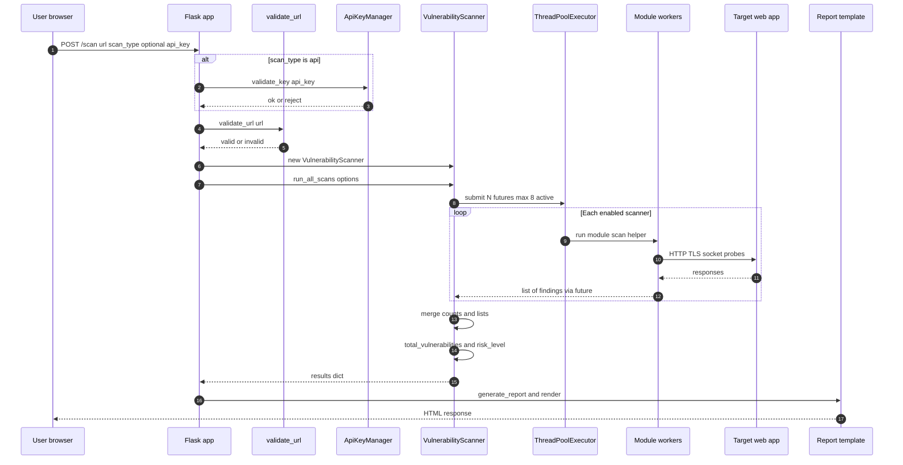
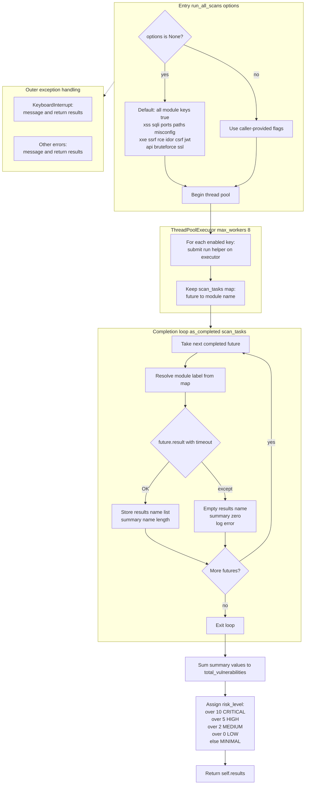
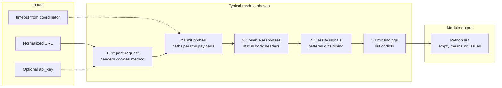
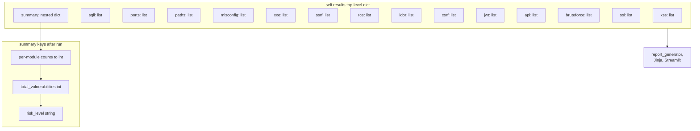
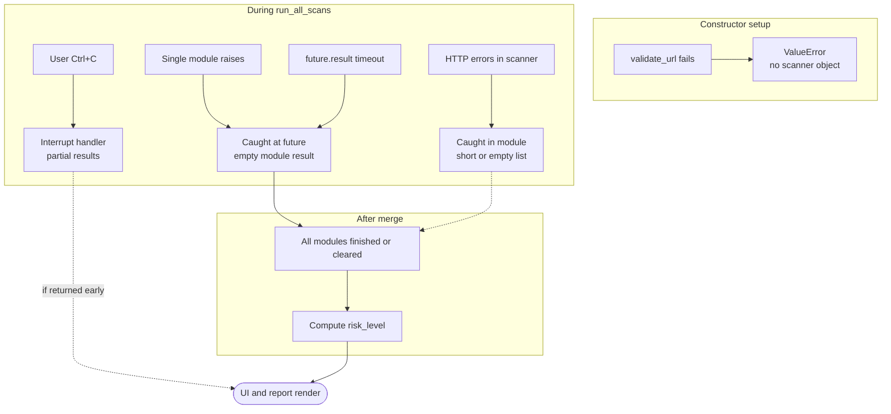

# CyberWolfScanner — Working Principles, Flowcharts, and References

This document explains **how CyberWolfScanner works** end-to-end: user interaction, scan orchestration, modular checks, aggregation, reporting, and error handling. It complements the diagrams under `Document/assets/flowcharts/` (SVG) and `Document/07_System_Architecture.md` / `Document/10_Dataflow_Workflow_Tables.md`.

**Mermaid note:** GitHub and some Markdown previews use a strict Mermaid lexer. Diagrams below avoid **backticks**, raw **`{}` with nested quotes**, and tricky **`&`** inside labels so they render reliably. File names appear as plain text inside nodes.

**How to view large diagrams:** If the preview truncates, use [Mermaid Live Editor](https://mermaid.live) at full width.

---

## 0. Overall system flow (one diagram)

End-to-end path from operator action to report. (Code refs: `app.py`, `wolf.py`, `modules/scanner.py`, `utils/validator.py`.)

### Deep explanation (overall)

The only mandatory path is: **capture URL → validate → orchestrate scans → merge → risk label → present**. Flask may additionally validate an API key when the user picks an API-style scan. Streamlit may call helpers such as web scraping or AI analysis in parallel with or after scans; those paths are optional overlays on the same core.

---

## 1. Large-scale system architecture (layered)

### Deep explanation (architecture)

1. **Dual UI:** Flask suits classic multi-page flows; Streamlit suits dashboards. Both should pass the same backend contract: normalized URL, optional module flags, timeout.
2. **Validation first** avoids useless traffic; invalid URLs raise before ThreadPoolExecutor work (`validate_url` in scanner constructor).
3. **Modular scanners** live under `modules/` as separate concerns, similar to rule packs in commercial DAST tools.
4. **AI and scraping** augment output; they do not replace module findings.

---

## 2. End-to-end operational lifecycle (from click to risk label)

### Deep explanation (lifecycle)

1. **`options`:** If omitted, all modules run; otherwise only keys set true run.
2. **Pool size 8:** Caps concurrent module work.
3. **Per-module errors:** One failing module does not clear others.
4. **Risk label:** Count-derived heuristic, not CVSS.

### Alternate view: sequence diagram (Flask path)

---

## 3. Inside run_all_scans: futures, summaries, interrupts

### Deep explanation (orchestration)

1. **Wrappers:** Each `_run_*` method calls the corresponding scanner.scan(url, api_key).
2. **as_completed:** Results merge as futures finish.
3. **future.result(timeout):** Aligns thread wait with scan timeout.
4. **KeyboardInterrupt:** Returns partial results.

---

## 4. Generic single scanner module flow

---

## 5. Data model: results and summary

---

## 6. Error and resilience

---

## 7. Functional workflow table

| Step | Actor | Input | Processing | Output |
|------|-------|--------|------------|--------|
| 1 | User | Target URL, scan mode | Chooses web UI (Flask or Streamlit) | Scan request |
| 2 | System | URL | `validate_url` | Proceed or reject |
| 3 | System | URL, timeout, options | Construct `VulnerabilityScanner` | Ready orchestrator |
| 4 | System | Target | Parallel module execution | Per-module finding lists |
| 5 | System | Raw findings | Count + classify risk | `summary` |
| 6 | System | Results | `generate_report` / templates | HTML / downloadable report |
| 7 | User | Report | Review dashboard | Remediation planning |

---

## 8. Module-to-purpose mapping (scan layer)

| Module key | Purpose (short) |
|------------|-----------------|
| `xss` | Reflected/stored XSS heuristics |
| `sqli` | SQL injection probes / indicators |
| `ports` | Exposed services / port checks |
| `paths` | Sensitive path discovery |
| `misconfig` | Common header/config issues |
| `xxe` | XML external entity exposure patterns |
| `ssrf` | Server-side request misuse indicators |
| `rce` | Remote execution pattern signals |
| `idor` | Object reference access issues |
| `csrf` | CSRF protection signals |
| `jwt` | JWT structure / weak claims checks |
| `api` | REST/GraphQL-style API issues |
| `bruteforce` | Weak auth / rate-limit heuristics |
| `ssl` | TLS/SSL configuration review |

---

## 9. IEEE-style reference papers (table)

The following table lists **ten** references in **IEEE citation style** (numbered). Use `[1]`–`[10]` in your paper’s reference list. Verify page numbers and spelling against IEEE Xplore or the publisher site for final camera-ready copy.

| Ref. | IEEE-formatted bibliography |
|------|------------------------------|
| [1] | J. Bau, E. Bursztein, D. Gupta, and J. C. Mitchell, “State of the Art: Automated Black-Box Web Application Vulnerability Testing,” in *Proc. IEEE Symp. Security Privacy*, Oakland, CA, USA, 2010, pp. 332–346. |
| [2] | A. Doupé, M. Cova, and G. Vigna, “Why Johnny Can't Pentest: An Analysis of Black-Box Web Vulnerability Scanners,” in *Proc. 7th Int. Conf. Detection Intrusions Malware Vulnerability Assessment (DIMVA)*, Bonn, Germany, 2010, pp. 111–131, doi: 10.1007/978-3-642-14215-4\_7. |
| [3] | NIST, *Technical Guide to Information Security Testing and Assessment*, Special Publication 800-115, Aug. 2008. |
| [4] | MITRE, “2023 CWE Top 25 Most Dangerous Software Weaknesses,” MITRE Corp., 2023. [Online]. Available: https://cwe.mitre.org/top25/ |
| [5] | OWASP Foundation, “OWASP Top 10:2021 — The Ten Most Critical Web Application Security Risks,” OWASP, 2021. [Online]. Available: https://owasp.org/www-project-top-ten/ |
| [6] | D. Balzarotti et al., “Saner: Composing Static and Dynamic Analysis to Validate Sanitization in Web Applications,” in *Proc. IEEE Symp. Security Privacy*, Oakland, CA, USA, 2008, pp. 387–401. |
| [7] | J. C. Fonseca, M. Vieira, and H. Madeira, “Evaluation of Web Security Mechanisms Using Vulnerability & Attack Injection,” *IEEE Trans. Dependable Secure Comput.*, vol. 11, no. 5, pp. 453–468, Sep./Oct. 2014, doi: 10.1109/TDSC.2013.56. |
| [8] | S. Alazmi and D. Conte de León, “A Systematic Literature Review on the Characteristics and Effectiveness of Web Application Vulnerability Scanners,” *IEEE Access*, vol. 10, pp. 33200–33219, 2022, doi: 10.1109/ACCESS.2022.3161522. |
| [9] | S. B. Lipner, “Principles for Secure Software Development,” *IEEE Security Privacy*, vol. 9, no. 2, pp. 71–75, Mar./Apr. 2011, doi: 10.1109/MSP.2011.46. |
| [10] | J. V. Antunes, N. Neves, and P. Veríssimo, “Detection and Prediction of Resource Exhaustion Attacks,” in *Proc. IEEE/IFIP Int. Conf. Dependable Syst. Netw. (DSN)*, 2008, pp. 102–111, doi: 10.1109/DSN.2008.4630062. |

**Notes for authors**

- Entries **[1]**, **[6]**, **[7]**, **[8]**, **[9]**, and **[10]** are **IEEE** journals, magazines, or IEEE/co-sponsored conference proceedings (suitable for an IEEE-style reference list).
- **[2]** is a **highly cited** black-box scanner evaluation in **Springer LNCS** (DIMVA); commonly cited next to IEEE DAST work—confirm house style if your venue requires *only* IEEE publications.
- **[3]**, **[4]**, and **[5]** are **standards and industry bodies** (NIST, MITRE CWE, OWASP) frequently paired with IEEE sources in applied security papers.

Double-check vol./no./pages in IEEE Xplore before camera-ready submission; use the DOI links when available.

---

## 10. Link to repository artifacts

| Artifact | Path |
|---------|------|
| Architecture write-up | `Document/07_System_Architecture.md` |
| Workflow tables & Mermaid | `Document/10_Dataflow_Workflow_Tables.md` |
| SVG flowcharts | `Document/assets/flowcharts/*.svg` |
| Scan coordinator | `modules/scanner.py` |
| Flask integration | `app.py` |

---

*Document generated for CyberWolfScanner — working description, flowcharts, and bibliography table for academic referencing.*
